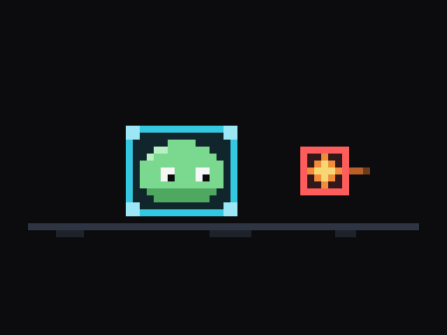

<div align="center">



# hitbox

**Cursor for game development: the Godot editor with an AI agent compiled in.**<br>
*A fork of Godot 4.7, not a plugin. The agent reads your project, edits scenes and scripts, runs the game and reads what it printed.*

</div>

---

Hitbox is a fork of [Godot Engine](https://godotengine.org) 4.7.2 with an AI agent built into the editor binary, the way Cursor forked VS Code. It opens like Godot, builds like Godot, and every Godot project works in it unchanged. The difference is a **Hitbox** dock next to the Inspector where you talk to Claude about the project in front of you, and it does the work in the editor.

## What the agent can do

Every message you send carries the editor's current context: the open scene and its root, the selected nodes, the active script and any selected text. On top of that the agent has tools over the editor:

- **Files.** List the project, read files, write files, make exact string edits, and search across all text files. Edited scripts reload in the script editor; an edited `.tscn` that is open reloads in the editor.
- **Scenes.** Dump the open scene's node tree, read a node's non-default properties, set properties, add nodes (engine classes or instanced `.tscn` files), remove nodes, attach scripts, save, and open scenes or scripts. Every scene change goes through the editor's undo history.
- **Running the game.** Play the main scene, the current scene or any scene, stop it, and read the Output panel, including prints and errors from the running game.
- **Engine reference.** Pull the class reference for any engine class from this exact build: inheritance, properties with defaults, method signatures, signals and constants. The agent is told to check it before using an API it is not sure about, which is what keeps it on Godot 4 syntax.

The agent streams its reply and its reasoning summary into the dock, shows each tool call as it runs, and keeps going through tool calls until the task is done or you press stop.

## Build and install

Hitbox builds exactly like Godot. On macOS with Apple Silicon:

```sh
brew install scons        # Python 3.9+ and Xcode command line tools are required too
make                      # build, bundle Hitbox.app, install to /Applications, launch
```

| Target | What it does |
| --- | --- |
| `make` | Build the editor, bundle it as `Hitbox.app`, copy it to `/Applications`, put `hitbox` on `$PATH`, launch it. |
| `make build` | Compile the editor binary only, into `bin/`. |
| `make install` | Bundle and install without launching. |
| `make update` | Stop a running Hitbox, remove it, rebuild, reinstall and relaunch. |
| `make smoke` | Headless editor run that sends one prompt through the dock and prints the transcript. With no API key it exercises the error path. |

The first build takes a while; later builds only recompile what changed. The macOS build uses Metal and does not need the Vulkan SDK. Other platforms use Godot's own build line, for example `scons platform=linuxbsd target=editor`; everything Hitbox adds is platform independent, only the Makefile is macOS specific.

## Setup

Hitbox talks to the Anthropic API directly from the editor. Give it a key in any of these ways:

1. Paste it into the field at the bottom of the Hitbox dock the first time you open it.
2. Editor Settings, then **Hitbox > Anthropic > API Key**.
3. Set the `ANTHROPIC_API_KEY` environment variable before launching.

The model picker at the top of the dock switches between Claude Opus 5 (the default), Claude Sonnet 5, Claude Fable 5.1 and Claude Haiku 4.5. The reasoning effort and the maximum number of tool rounds per message live under the same settings section.

Hitbox keeps its own editor settings, separate from Godot's, so installing it next to Godot does not touch your Godot configuration.

## How it is built

Everything Hitbox adds lives in one engine module, `modules/hitbox/`:

- `hitbox_dock.cpp` is the chat dock and the agent loop. Each API request streams on a worker thread; tool calls run on the main thread between requests, so they can touch editor state safely.
- `hitbox_client.cpp` is a small streaming client for the Anthropic Messages API over Godot's own HTTPS stack. No external dependencies.
- `hitbox_tools.cpp` defines the tools the model sees and implements them against the editor: file system, scene tree, undo history, run bar, output log and the class reference.
- `hitbox_editor_plugin.cpp` registers the editor settings and mounts the dock.

The smoke test lives in `misc/hitbox/smoke_project/`: a minimal project whose editor plugin calls the dock's scriptable surface (`send_prompt`, `is_busy`, `get_transcript_text`), which any editor plugin can use too.

Outside the module the fork touches two files: `version.py`, which names the product, and `editor/editor_log.h`, which gains four one-line accessors so the agent can read the Output panel. Keeping the footprint that small is deliberate. Upstream Godot releases merge in with `git fetch upstream` followed by a merge of the new stable tag.

## Upstream

Godot Engine is Copyright (c) 2014-present Godot Engine contributors and Copyright (c) 2007-2014 Juan Linietsky, Ariel Manzur, released under the MIT license. Hitbox keeps that license; see `LICENSE.txt` and `COPYRIGHT.txt`. Godot's own README, documentation and community live at [godotengine.org](https://godotengine.org).
